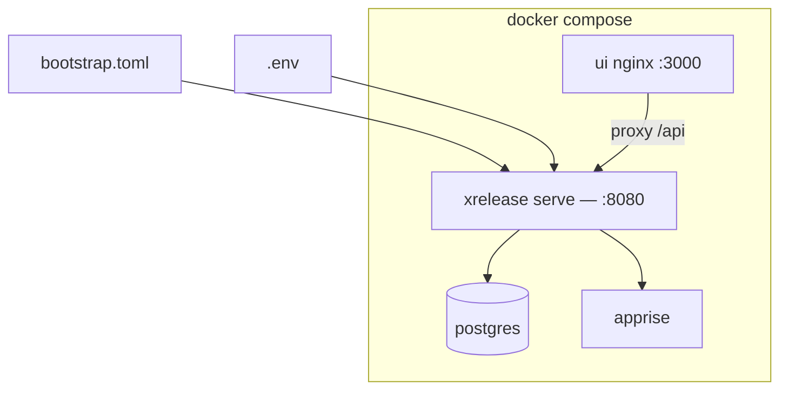

# Docker Compose deployment

Default stack: **PostgreSQL + backend + UI (nginx) + Apprise** — published
GHCR images.

| File | Command |
|------|---------|
| [`docker-compose.yaml`](../docker-compose.yaml) | `docker compose up -d` |

**Default `bootstrap.toml`:** multi-org **API + UI**. Desired state → Postgres
ledger via dashboard. OIDC = your IdP — [oidc.md](../docs/operations/oidc.md).
Kubernetes: [`deploy/k8s/README.md`](../deploy/k8s/README.md).

## Quick start

```bash
cp .env.example .env
# edit secrets
docker compose up -d
# → http://127.0.0.1:3000
```

## Layout

| File | Role |
|------|------|
| [`../docker-compose.yaml`](../docker-compose.yaml) | GHCR images (`pull_policy: always`) |
| `Dockerfile` / `Dockerfile.ui` / `Dockerfile.cli` | Image definitions used by releases |
| [`compose.tls.yaml`](compose.tls.yaml) | HTTPS on UI nginx (`cert.pem` / `key.pem`) |
| [`nginx.tls.conf`](nginx.tls.conf) | nginx TLS config mounted by the overlay |
| [`certs/`](certs/README.md) | `cert.pem` + `key.pem` (paths via `.env`) |

## Architecture



| Service | Host port |
|---------|-----------|
| `postgres` | *(unpublished)* |
| `xrelease` | *(unpublished — use UI :3000)* |
| `ui` | `127.0.0.1:3000` |
| `apprise` | `127.0.0.1:8000` (lab convenience — drop it in production) |

```bash
xrctl --api-url http://127.0.0.1:3000 --api-key "$XRELEASE_API_KEY" status
```

## Container hardening

Every service runs with `no-new-privileges` and a memory limit. The backend
additionally drops all capabilities and runs with a **read-only root
filesystem** (`tmpfs` for `/data` and `/tmp`) — all state lives in PostgreSQL.
The UI keeps a writable filesystem because `docker-entrypoint.d` regenerates
`/ui-config.js` on every start.

PostgreSQL keeps its default capabilities: the official entrypoint still needs
`chown`/`setuid` to drop to the `postgres` user.

## Development

`docker/docker-compose.dev.yaml` builds from source and tags the result
`xrelease:dev` / `xrelease-ui:dev`, so a local build never shadows the
published GHCR image in your image store.

```bash
docker compose -f docker/docker-compose.dev.yaml up -d --build
```

## Config vs secrets

| In Git | In `.env` |
|---|---|
| `bootstrap.toml` | `XRELEASE_*`, `POSTGRES_*`, forge tokens, `VITE_*` |

## HTTPS (UI nginx + cert/key)

TLS terminates on the UI nginx container. Configure in `.env`, then:

```bash
docker compose -f docker-compose.yaml -f docker/compose.tls.yaml up -d
# → https://$XRELEASE_PUBLIC_HOST
```

The overlay publishes ports **80/443 on all interfaces**, unlike the plain
HTTP stack which is loopback-only. Two consequences:

- `/metrics` returns `404` there — it needs no auth and this server faces the
  internet. Scrape the backend from inside the compose network instead
  ([Grafana](../deploy/grafana/README.md)).
- Needs **Docker Engine ≥ 26**, which sets
  `net.ipv4.ip_unprivileged_port_start=0` inside containers so the non-root
  nginx (UID 101) can bind 80/443. On older engines use
  `XRELEASE_TLS_HTTP_PORT` / `XRELEASE_TLS_HTTPS_PORT` above 1024.

Guide: [TLS](../docs/operations/tls.md).

## Optional

| Topic | Doc |
|---|---|
| HTTPS (PEM certs) | [tls.md](../docs/operations/tls.md) |
| SSO | [oidc.md](../docs/operations/oidc.md) |
| Apply from CI | [ci-cd.md](../docs/operations/ci-cd.md) |

## Limits

One `serve` poller per database. Do not scale the backend replica count.
