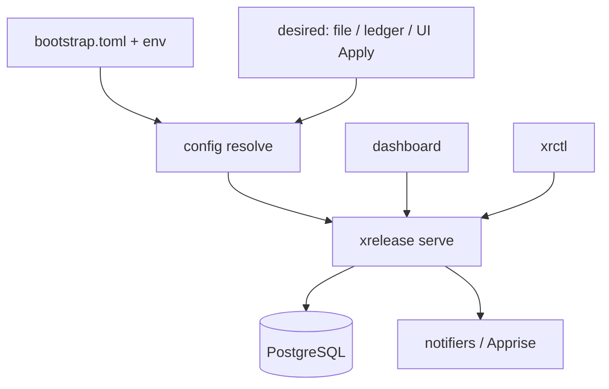
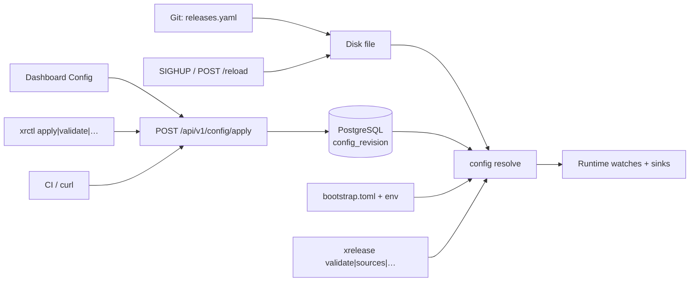

# Architecture

## Summary

`bootstrap.toml` + desired state (Git YAML | API ledger | UI Apply) resolve into
one `xrelease serve` process: poller, outbox, sinks, and the HTTP API. The
dashboard and `xrctl` are clients of that process.

## Binaries

| Binary | Role |
|---|---|
| **`xrelease`** | Instance process: `serve` (default) plus local ops (`validate`, `health`, `sources`, …) |
| **`xrctl`** | Remote management client over HTTP — no Postgres, no local config authority |

`serve` **is the backend**: one process runs the poller, outbox, sinks, and the
HTTP API (including webhooks). Manual one-shot polls use `POST /api/v1/check`
against a running `serve`.

## Design principles

- **Identity-set diff** — not semver comparison
- **Silent baseline** — first poll never floods history
- **At-least-once delivery** — transactional outbox + per-sink retries
- **Polling + webhooks** — push reduces latency where available
- **Single poller per database** — PostgreSQL advisory lock on `serve`; see [Scaling](../operations/scaling.md)
- **Split config** — infra (`bootstrap.toml`) vs desired state (Git YAML, API ledger, and/or UI Apply)
- **Flexible authoring** — file authority, API/CI apply, or dashboard editor; see [configuration](../configuration/overview.md#authoring-variants)
- **Two binaries** — backend (`xrelease`) and management CLI (`xrctl`)
- **Fail-closed management auth** — `api.require_auth` defaults to `true`

## Config lifecycle

| Surface | Role |
|---|---|
| **`xrelease` (local)** | `validate` / `sources` / `health` / `serve` — same resolve path (`source=api` → ledger when a revision exists, else optional seed file / empty). No remote push-apply; use `xrctl` / HTTP or edit the file. |
| **`xrctl` (remote)** | Pure HTTP client against a running `serve`: status, sources, outbox, config show/schema/history, validate/apply/rollback/reload. |
| **API** | `GET /config`, `/schema`, `/revisions`; `POST /validate`, `/apply`, `/rollback`, `/reload` — hot-swap desired state without restarting infra. |
| **UI** | Observability by default. Config form editor in the **API + UI** variant. Blocked when `source = local` or `ui_config = false`. |
| **PostgreSQL** | Runtime state (`seen_release`, outbox, …) plus optional `config_revision` ledger. Secret **values** live in `app_secret` (AES-GCM); the document keeps `*_env` refs. |

Authority is explicit via `[config_api]`:

| Variant | Flags | Boot / apply |
|---|---|---|
| **Local** | `api_config=false`, `source=local`, `ui_config=false` | File; apply 404 |
| **API** | `api_config=true`, `source=api`, `ui_config=false` | Ledger; apply allowed |
| **API + UI** | as API + `ui_config=true` | Same; dashboard editor on. Omit `[[organizations]].app` (or leave empty) to boot **idle** until first Apply. |

Invalid: `api_config=false` + `source=api`, or `ui_config=true` without API apply.
