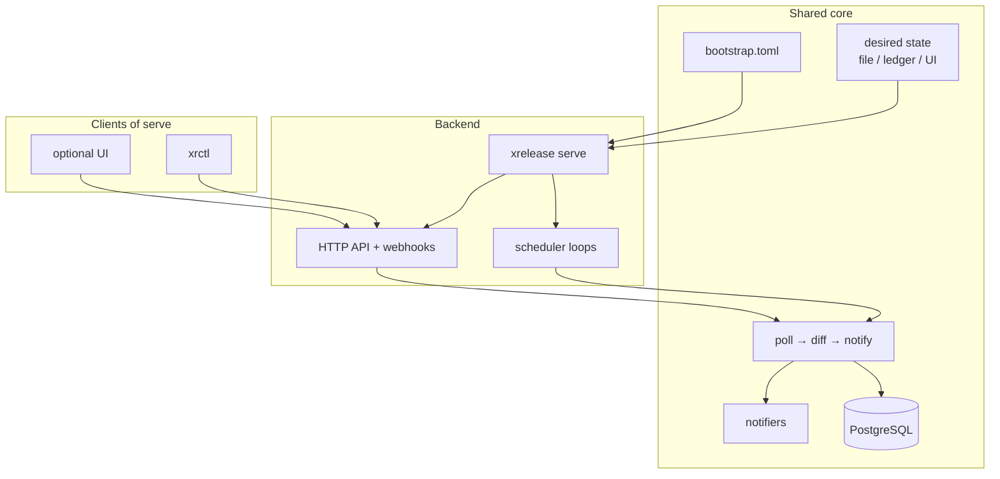

# Runtime deployment

Canonical install and runtime guide (Compose / Helm / binaries / CLI).
Authoring variants (how you edit desired state): [Configuration overview](../configuration/overview.md#authoring-variants).
First run: [Quick start](../getting-started/quickstart.md).

## What xrelease is (and is not)

xrelease is a **self-hosted release notifier**: you run the **`xrelease` backend**
on your own infrastructure. Configuration, PostgreSQL state, and notification
secrets never leave your environment.

Two binaries ship independently:

| Binary | Role |
|---|---|
| **`xrelease`** | Backend / instance — poller, outbox, sinks, HTTP API + webhooks (`serve`) |
| **`xrctl`** | Lean remote management CLI (HTTP only) — see [xrctl](../api/cli.md) |

Feature comparison with other tools:
[Comparison with alternatives](../project/comparison.md).

## Two binaries, one runtime

The **`xrelease`** executable runs as **`serve`** (poller + API + webhooks).
All deployments share the same split (`bootstrap.toml` + desired state), the
same provider adapters, and the same PostgreSQL database. **`xrctl`** never
runs the pipeline; it only calls a live `serve` instance. On-demand polls use
`POST /api/v1/check`.



### Serve (backend: API + poller)

**Command:** `xrelease serve` — also the **default** when no subcommand is given,
and the Docker Compose / Helm `command`.

- Full backend in one process: poller + outbox + sinks **and** the HTTP API
- OpenAPI at `GET /openapi.json`; webhooks at `POST /api/v1/webhooks/*`
- Optional Bearer auth for management routes (API key / local session / OIDC)
- **Best for:** forge webhooks, observability API, optional UI, `xrctl`

```sh
# Full stack (UI + backend + Apprise + Postgres) — published images
docker compose up -d
curl http://127.0.0.1:3000/openapi.json
```

**Production:** keep `api.require_auth = true` (default) and configure authentication
([Authentication](authentication.md)) so an open management API cannot start.
Without credentials, `serve` emits a loud startup warning.
Polling remains the fallback when webhooks are unavailable or misconfigured.

## Install decision matrix

| Platform | Mode | UI | Auth notes | Config authority |
|---|---|---|---|---|
| Compose | `serve` | on (`:3000`) | local admin + API key; OIDC → your IdP | **API + UI** (`docker-compose.yaml`) |
| Helm | `serve` | on | `require_auth = true` + session/admin | **API + UI** (chart defaults) |
| Helm prod | `serve`, external PG | optional | Secret + Ingress TLS | Local / API / API+UI via examples |
| Remote ops | — | — | API key to `serve` | `xrctl apply` when `source=api` |

**Important:** one poller per PostgreSQL database — a second `serve` fails with
`PollerBusy` while another holds the advisory lease.

## Docker Compose (recommended)

Primary deployment path. See [`docker/README.md`](../../docker/README.md).

```
┌────────────── docker-compose.yaml (GHCR) ───────────┐
│  ui (:3000) ──proxy /api──▶  xrelease serve (:8080) │
│  xrelease ──HTTP──▶  apprise:8000                   │
│  xrelease ──SQL───▶  postgres:5432                  │
│  bootstrap.toml mounted RO (lab: UI + multi-org)    │
│  desired state → Postgres ledger (UI / xrctl Apply) │
│  secrets in .env (XRELEASE_DATABASE_URL, tokens)    │
└─────────────────────────────────────────────────────┘
```

See [docker/README.md](../../docker/README.md) for step-by-step setup.
Optional: [TLS](tls.md) and [OIDC](oidc.md).
Apply desired state from your pipelines: [CI/CD integration](ci-cd.md).

## Binary without UI

The UI is an **optional** companion. The `xrelease` binary never embeds
it. Without UI you still get full poll → notify behaviour via `serve`
(disable or omit the UI container / Helm `ui.enabled: false`):

| Setup | Command | Needs Postgres | Needs Apprise / notifiers |
|---|---|---|---|
| Backend (API + poller) | `xrelease serve` | yes | yes |
| List configured sources | `xrelease sources` | **no** | no |
| Lint config (GitOps CI) | `xrelease validate` | URL required in config/env; **no live connection** | sinks must be declared |
| Online source probes | `xrelease validate --online` | yes | no |
| DB probe | `xrelease health` | yes (connects) | no |
| Revive dead outbox | `xrelease outbox-requeue` or `POST /api/v1/outbox/requeue` | yes | serve for API |
| Manual poll | `POST /api/v1/check` | via serve | yes |
| Remote management | `xrctl …` | no (uses API) | needs running `serve` |

`validate` fails if `database.postgres_url` / `XRELEASE_DATABASE_URL` is empty
(config completeness), but it does not open a pool. `sources` works with an
unreachable database as long as the config parses and sources resolve.

## CLI reference

### `xrelease` (local instance / ops)

| Command | Mode | Needs Postgres | Persists state | Sends notifications |
|---|---|---|---|---|
| `xrelease serve` (default) | Backend (API + poller) | connect | yes | yes |
| `xrelease sources` | List config | no | no | no |
| `xrelease health` | Probe | connect | no | no |
| `xrelease validate` | Config lint | URL in config only | no | no |
| `xrelease outbox-requeue` | Revive dead letters | connect | yes | no |

JSON output for scripting:

```sh
xrelease sources --format json
xrelease validate --format json
```

### `xrctl` (remote management)

Separate binary — see [xrctl](../api/cli.md). Requires a running `xrelease serve`.

## Configuration model

- **Declarative:** desired document lists sources, teams, notifiers;
  `bootstrap.toml` carries infra (+ optional `[[organizations]]`)
- **Secrets via env:** `XRELEASE_DATABASE_URL`, `XRELEASE_API_KEY`,
  `XRELEASE_EXPRESS_*` / `XRELEASE_SMTP_PASSWORD`, upstream tokens.
  Apprise **targets** (`urls` / `config_key`) live in the desired document / UI.
  Compose/Helm may set `XRELEASE_APPRISE_ENDPOINT` for the sidecar URL.
- **Team routing:** `routing_tag` on sources, `tags` on notifiers
- **Shared source template:** every source supports `pattern`, `exclude_pattern`,
  `include_prerelease`, schedule overrides

| Deploy path | Typical authoring |
|---|---|
| **Docker lab** (`docker compose`) | **API + UI** — multi-org Apply → Postgres ledger |
| **Helm** (chart defaults) | **API + UI** — single-doc Apply → Postgres ledger |
| **Local** (examples / GitOps) | Edit YAML → reload / restart |
| **API** (examples / CI) | `xrctl apply` / `POST /config/apply` |
| **API + UI** | Dashboard Config + same apply API |

Details: [authoring variants](../configuration/overview.md#authoring-variants),
[Docker](../getting-started/docker.md), [Kubernetes](../getting-started/kubernetes.md).

## Alternatives

See [Comparison with alternatives](../project/comparison.md).

## Kubernetes

Helm chart and evaluation values: [`deploy/k8s/README.md`](../../deploy/k8s/README.md).
